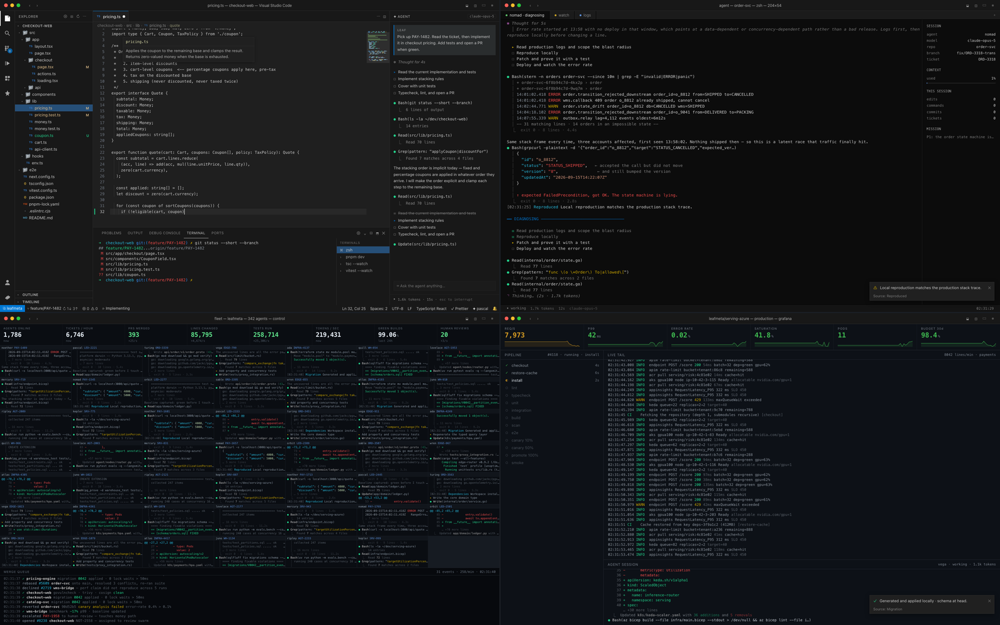

# GhostCoder

**AI Employee · Autonomous Engineer Simulator**

한국어 · [English](README_en.md)

AI 에이전트가 티켓을 읽고, 코드를 읽고, 코드를 쓰고, 테스트를 돌리고, 깨진 것을 고치고,
커밋하고, PR 을 올리고, 배포합니다 — 실제 작업 화면과 구별되지 않는 화면 위에서.
그리고 다음 티켓을 받아 다시 시작합니다. 끝없이.

**[▸ 지금 실행하기](https://leaf-kit.github.io/game-ghost-coder/)**



빌드 과정도, 의존성도, 네트워크 요청도 없습니다. 당신의 컴퓨터에서 파일을 읽거나 쓰지도
않습니다. HTML 파일 하나와 스크립트 세 개뿐입니다.

---

## 화면에 실제로 있는 것

이 프로젝트의 목적은 사실감입니다. 모든 화면은 실제 도구를 그대로 옮겼습니다 — 색값,
행 높이, 프롬프트 형식, 출력의 정확한 모양까지.

**IDE** — Visual Studio Code. 커스텀 타이틀바, 코디콘 모양의 액티비티 바, git 표시가
붙은 파일 트리(`M`/`U`), 수정 표시 점이 있는 탭, 빵가루 내비게이션, 줄별 git 여백 표시가
있는 줄 번호, 괄호 쌍 색상화, 들여쓰기 안내선, 진짜 미니맵, 물결 밑줄 오류 표시,
Tab 으로 받는 Copilot 스타일 인라인 고스트 텍스트, 문제 패널, oh-my-zsh 프롬프트가 있는
통합 터미널, 브랜치·오류 수·커서 위치를 따라가는 상태바 — 그리고 Claude Code 나 Codex 가
하는 방식으로 툴 호출을 흘리는 에이전트 사이드 패널.

**Agent** — 전체화면 헤드리스 CLI 세션. 타이핑이 전혀 없습니다. 에이전트가 `Read(...)`,
`Update(...)`, 통합 diff, 전체 출력이 딸린 `Bash(...)`, 경과 초가 붙은 생각 스피너,
실시간 토큰 카운터, 컨텍스트 사용량 바를 뱉습니다. 키보드에 사람이 없어야 할 때 쓰는
화면입니다.

**Swarm** — 네 개의 다른 티켓을 네 대의 에이전트가 tmux 2×2 격자에서. 각 판에 고유한
제목과 단계 표시, 독립된 출력 스트림이 있고 전부 동시에 돌아갑니다.

**Ops** — SRE 벽면. 스피너와 소요 시간을 달고 스스로 진행하는 14단계 CI 파이프라인,
분당 약 8,000줄로 흐르며 시각이 단조 증가하는 실시간 로그, 스파크라인이 있는 지표 타일
여섯 개, 그 아래 압축된 에이전트 세션.

**AGI** — 자율 플릿. 최대 **100개**의 살아 있는 에이전트 판, 집계 처리량 카운터(가동
에이전트, 시간당 티켓, 머지된 PR, 변경된 줄 수, 실행된 테스트, 초당 토큰, 빌드 성공률,
사람 리뷰 수), 그리고 머지 큐 소방호스. 어떤 팀도 낼 수 없는 처리량 — 그게 이 화면의
메시지입니다.

**⛊ 화이트해커 — 침해 대응** — 별도의 방어 화면. 2026년 금융권 AI 침해 사고(크리덴셜
스터핑, 외곽 시스템 인증 우회, 대출 조회 API 대량 열람, `ARTEX` 자율 침투 도구 흔적)를
교보재로 재구성했습니다. 왼쪽에는 "실제 서버에 이렇게 찍혔을 것"이라 예측한 접근 로그가
흐르고 — 리퍼러·응답시간(`rt`)·메서드·상태코드까지 담아 실제 WAS/프록시 로그처럼 —
오른쪽에서는 **블루팀 에이전트**가 단계마다 **무엇이 문제인지**를 네 종류의 카드로
풀어냅니다: **탐지(DETECT) → 진단(DIAGNOSE) → 교육(LEARN) → 대응(FIX)**. 각 카드에는
심각도와 OWASP·MITRE ATT&CK 매핑이 붙습니다. 상단 바는 보안관제 분석가가 대응 중임을 —
작업자가 일하고 있음을 — 보여 줍니다.

사고는 **9단계 타임라인**으로 전개됩니다. 공격 상황마다 로그 패턴과 에이전트의 분석이
함께 바뀝니다.

| 단계 | 공격 상황 | 매핑 |
|---|---|---|
| 평시 | 정상 기준선 수립 | — |
| 정찰 | `ARTEX` 자율 스캐너의 경로 열거 | T1595 |
| **SQL 인젝션** | 대출 검색 파라미터에 `UNION`·`WAITFOR`·`CONVERT` 주입 | A03:2021 · T1190 |
| 크리덴셜 스터핑 | 분산 IP로 유출 ID/PW 대입, 일부 성공 | A07:2021 · T1110.004 |
| 외곽 우회 | WAF 밖 대출모집인·직원 포털로 인증 우회 | A01/A05:2021 |
| **웹셸 업로드 · RCE** | 업로드 제한 부재 → `cmd=` 원격 명령 실행 | T1505.003 |
| **SSRF · 자격증명 탈취** | `169.254.169.254` 메타데이터로 클라우드 IAM 키 탈취 | A10:2021 · T1552.005 |
| 대량 열람 | 순차 ID로 개인정보 전수 조회(IDOR/BOLA) | API1:2023 |
| 탐지·차단 | WAF 룰 배포·세션 만료·사후 교훈 | — |

공격을 가르치는 화면이 아니라 막는 법을 가르치는 교육용 화면이고, 모든 로그는 합성이며
IP는 전부 문서화용 예약 대역(RFC 5737)입니다. 한국어/영어를 모두 지원합니다.

---

## 개발 환경

여덟 가지입니다. 각각이 저장소, 파일 트리, 언어, 툴체인, 그리고 **터미널 출력의 모든
줄**을 바꿉니다. 화면의 코드는 진짜 코드입니다 — 이 프로젝트를 위해 쓴 것이고, 의미 없는
채움글이 아닙니다. 명령 출력도 해당 도구가 실제로 찍는 것과 일치합니다.

| 환경 | 저장소 | 툴체인 | 도메인 |
|---|---|---|---|
| **TypeScript · Next.js** | `checkout-web` | pnpm, Next 15, Vitest, ESLint, tsc | 결제와 쿠폰 가격 계산 |
| **Python · FastAPI** | `ledger-api` | uv, SQLAlchemy 2, pytest, ruff, mypy | 복식부기 결제 원장 |
| **Go · gRPC** | `order-svc` | protobuf, sqlc, testcontainers, golangci-lint | 주문 상태 기계 |
| **Rust · Tokio** | `edge-router` | cargo, axum, tower, criterion, clippy | 엣지 레이트 리밋 |
| **SRE · K8s + Terraform** | `platform-infra` | terraform, kubectl, helm, argocd, promtool | 노드 풀, HPA, SLO 알림 |
| **PostgreSQL · 데이터** | `warehouse-db` | psql, Flyway, pgTAP, sqlfluff, pgbench | 파티셔닝과 실행 계획 |
| **LangChain · 에이전트 개발** | `agent-platform` | LangGraph, LangSmith, pgvector, ragas | 에이전트 구축과 평가 |
| **Azure · 모델 서빙** | `serving-azure` | az CLI, Bicep, AKS, Azure ML, APIM | 블루/그린 추론 롤아웃 |

## 미션

여덟 가지이고, 순환합니다. 하나가 끝나면 티켓 번호가 올라간 다음 티켓이 저절로 시작됩니다.

`기능 개발` · `장애 대응 — P1` · `리팩터링 마라톤` · `신규 구축 — 맨바닥부터` ·
`테스트 · 보안 강화` · `마이그레이션` · `코드 리뷰` · `성능 개선`

미션 8개 × 환경 8개 = **64가지 서로 다른 실행**, 약 2,200개의 비트.

---

## 조작

모든 단축키가 실제 VS Code 단축키입니다. 그래서 무엇을 눌러도 어색해 보이지 않습니다.

| 키 | 동작 |
|---|---|
| `Esc` | 설정으로 돌아가기 |
| `Space` | 일시정지 / 재생 |
| `` ` `` | **집중 모드** — 터미널을 최대로 키우고 빌드 출력을 즉시 쏟아붓습니다 |
| `1` – `5` | 속도: 사람 → 카페인 → 에이전트 → 터보 → **초고속** |
| `L` | 화면 전환 |
| `F` / `F11` | 전체화면 |
| `⌘B` / `⌘J` / `⌘\`` | 사이드바 / 패널 / 터미널 토글 |
| `⌘⇧P` | 커맨드 팔레트 |

마우스를 움직이면 나타나고 2.6초 뒤에 사라지는 조작 바도 있습니다 — **메인**,
**일시정지**, **초고속**, **화면 전환**, **전체화면**. 타이틀바의 macOS 신호등도
동작합니다. 빨강은 설정으로, 노랑은 일시정지, 초록은 전체화면입니다. 가짜 화면 위에
무언가를 계속 그려 두지 않는데, 떠 있는 게임 UI 야말로 이걸 들키게 하는 단 하나이기
때문입니다.

## 언어

기본은 영어입니다. 한국어를 선택하면 런처, VS Code 크롬 라벨, 에이전트가 하는 말 전부가
한국어가 됩니다. 코드, 명령어, 터미널 출력, 로그, 파일 경로는 영어로 남습니다 — 한국
개발자 화면에서도 저것들은 영어이고, 여기서 한글이 나오면 오히려 가짜가 됩니다.

## 옵션

- **에디터 알림** — VS Code 알림. 테스트 결과, 포매터, PR 생성.
- **메신저 알림** — 동료들이 구석에서 반응합니다. 가장 설득력 있는 한 가지인데, 다른
  사람들이 그 작업이 진행되고 있다고 믿는다는 뜻이 되기 때문입니다.
- **커맨드 팔레트** — 키보드로 에디터를 조작하는 사람에게 그러듯 이따금 열립니다.
- **멈추지 않기** — 미션을 끝없이 순환합니다.
- **키보드 소리** — 합성 키 클릭. 기본은 꺼짐이고, 의도한 것입니다. 아무도 손대지 않은
  키보드에서 타이핑 소리가 나는 것이야말로 실제로 들키는 이유입니다.

---

## 실행

```bash
open index.html            # 파일 시스템에서 바로 열어도 동작합니다
# 또는 http:// 로 띄우려면
python3 serve.py           # http://localhost:8010
python3 serve.py 8080      # 포트 지정
./start_server.sh          # 같은 동작
```

정적 페이지이므로 GitHub Pages 나 다른 정적 호스팅에 그대로 올려도 동작합니다.

### URL 파라미터 · 해시뱅 딥링크

남는 모니터, 회의실 스크린, 키오스크에 띄워 둘 때 유용합니다. 두 가지 방식을
모두 받습니다.

**해시뱅(`#!`) — 공유용(권장).** 설정을 고르고 **출근**을 누르면, 그 설정이
주소창의 해시에 자동으로 적힙니다. 그 URL 을 그대로 북마크·공유하면 다음에
열었을 때 **같은 모드로 바로 입장**합니다. `leaf-kit.github.io` 같은 정적
호스팅에서도 됩니다. 빠진 값은 전부 기본값으로 떨어지고, **기본값과 같은 설정은
URL 에서 생략**돼 주소가 최대한 짧게 유지됩니다(전부 기본값이면 해시 자체가
사라집니다). 이미 열려 있는 탭의 주소창에 다른 해시를 붙여넣으면 그 모드로
즉시 전환됩니다.

```
#!layout=whitehat                       ← 나머지는 전부 기본값
#!layout=agi&fleet=100&pace=hyper
#!layout=ops&theme=github_dark&lang=en
```

**쿼리스트링(`?`) — 기존 호환.** `auto=1` 이면 바로 시작합니다.

```
?auto=1&layout=agent&stack=go&mission=incident&pace=turbo
```

해시와 쿼리에 쓰는 키는 같습니다(쿼리가 해시를 덮어씁니다).

| 파라미터 | 값 |
|---|---|
| `auto` | `1` 이면 바로 시작(쿼리 전용 · 해시는 있으면 자동 입장) |
| `layout` | `ide` `agent` `swarm` `ops` `agi` `whitehat` |
| `stack` | `next` `fastapi` `go` `rust` `k8s` `postgres` `langchain` `azure` |
| `mission` | `feature` `incident` `refactor` `greenfield` `harden` `migrate` `review` `perf` |
| `theme` | `dark_modern` `dark_plus` `monokai` `one_dark` `github_dark` |
| `pace` | `human` `caff` `agentp` `turbo` `hyper` |
| `fleet` | `1`–`100` (AGI 화면) |
| `lang` | `en` `ko` |
| `user` `agent` `model` | 자유 입력 / 모델 id 중 하나 |
| `notifs` `pings` `palette` `loop` `sound` | `0` 또는 `1` |

---

## 구조

```
index.html      UI, CSS, 엔진
syntax.js       줄 단위 토크나이저 + 실제 VS Code 테마 5종
scenarios.js    모든 콘텐츠: 환경 8종, 미션 8종, 출력의 모든 줄
i18n.js         한국어
serve.py        선택적 정적 서버
```

네 개의 파일. 빌드도, CDN 도, 프레임워크도 없습니다.

**세 축이 서로 곱해집니다.** *스택*이 역할 키(`impl`, `test`, `patch`, `test_fail`,
`deploy`, …) 아래에 구체적인 파일과 명령을 제공합니다. *미션*은 작업의 모양만 정의하고
역할을 이름으로 요청하므로, 어떤 스택 위에서 돌고 있는지 알지 못합니다. *레이아웃*이
같은 비트를 어떻게 그릴지 결정합니다.

```
scenarios.js ──비트──▶ Director ──▶ Sink
                                   ├─ IdeSink     VS Code 에디터에 타이핑
                                   └─ StreamSink  에이전트 출력, 타이핑 없음
```

하나의 스크립트, 네 가지 렌더링. 같은 `edit` 비트가 IDE 에서는 한 글자씩 타이핑되고
에이전트 스트림에서는 통합 diff 가 됩니다 — "코드가 쓰이는 것을 보는 것"과 "에이전트가
결과를 보고하는 것을 보는 것"에 별도의 콘텐츠가 필요하지 않았던 이유입니다.

**토크나이저는 의도적으로 줄 단위입니다.** 타이핑은 키 입력마다 한 줄을 다시 그리므로,
각 줄이 들어오는 블록 상태(주석 안, 문자열 안, 괄호 깊이)를 받아 나가는 상태를
돌려줍니다. 토큰 타입은 CSS 클래스로 나가고 테마는 CSS 변수를 설정하므로, 테마를 바꾸는
데 비용이 들지 않습니다.

**모든 비동기 흐름은 중단 가능합니다.** 세대 카운터가 설정 변경이나 재시작 시 대기 중인
모든 `await` 를 무효화하고, `wait()` 는 일시정지와 속도 배수를 존중합니다.

---

## 이것이 아닌 것

무엇도 실행하지 않고, 어디에도 연결하지 않고, 당신의 파일을 건드리지 않습니다. 화면의
어떤 것도 실제 저장소나 실제 배포, 실제 테스트 실행이 아닙니다. 일의 그림입니다 — 방
건너에서는 차이가 보이지 않을 만큼 공들여 그린.

## 라이선스

MIT. [LICENSE](LICENSE) 참조.
