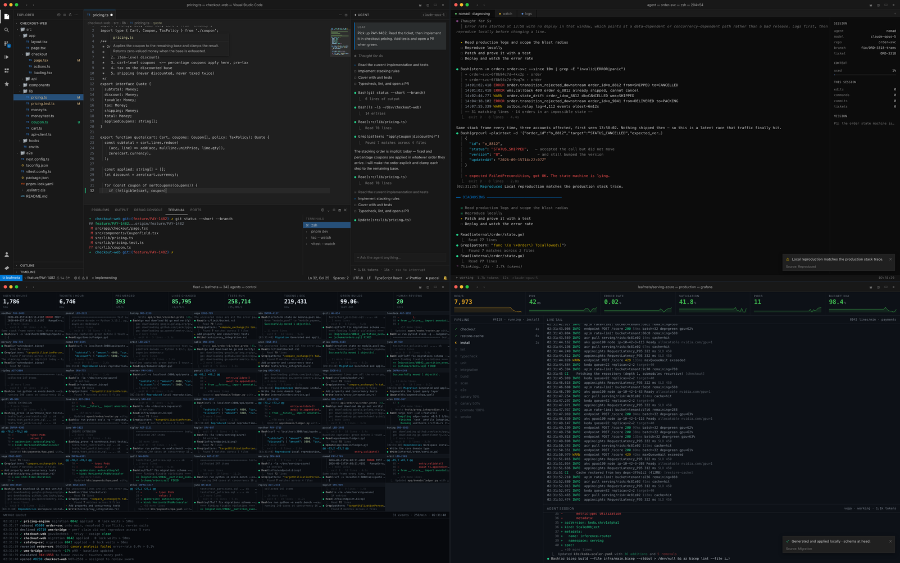

# GhostCoder

**AI Employee · Autonomous Engineer Simulator**

[한국어](README.md) · English

An AI agent reads a ticket, reads the code, writes the code, runs the tests, fixes what
broke, commits, opens the PR, and deploys — on a screen that is indistinguishable from a
real working session. Then it picks up the next ticket and does it again, forever.

**[▸ Run it now](https://leaf-kit.github.io/game-ghost-coder/)**



Open `index.html`. Pick a layout, a development environment, a mission. Press **Clock in**.

No build step, no dependencies, no network calls, no files read or written on your machine.
One HTML file and three scripts.

---

## What is actually on screen

The point of this project is fidelity. Every screen is modelled on the real tool, down to
the colour values, the row heights, the prompt format and the exact shape of the output.

**IDE** — Visual Studio Code. Custom title bar, activity bar with codicon shapes, file
tree with git decorations (`M`/`U`), tabs with the dirty dot, breadcrumbs, line numbers
with per-line git gutter marks, bracket-pair colourisation, indent guides, a real minimap,
squiggly error underlines, inline Copilot-style ghost text accepted with Tab, the Problems
panel, the integrated terminal with an oh-my-zsh prompt, a status bar that tracks branch,
error counts and cursor position — and an agent side panel that streams tool calls the way
Claude Code and Codex do.

**Agent** — a full-screen headless CLI session. No typing at all: the agent emits
`Read(...)`, `Update(...)`, unified diffs, `Bash(...)` with full command output, a thinking
spinner with elapsed seconds, a live token counter, and a context-usage bar. This is the
layout to use when nobody should see a human at the keyboard.

**Swarm** — four agents on four different tickets in a tmux 2×2 grid, each with its own
pane title, phase indicator and independent output stream, all running at once.

**Ops** — an SRE wall. A fourteen-stage CI pipeline that walks itself with spinners and
timings, a live log tail at ~8,000 lines/minute with monotonic timestamps, six metric tiles
with sparklines, and a compact agent session underneath.

**AGI** — the autonomous fleet. Up to **100** live agent panes at once, aggregate
throughput counters (agents online, tickets/hour, PRs merged, lines changed, tests run,
tokens/sec, green-build rate, human reviews) and a merge-queue firehose. Throughput no
team could produce, which is the message.

---

## Development environments

Eight of them. Each one changes the repository, the file tree, the language, the toolchain
and **every line of terminal output**. The code on screen is real code — written for this
project, not lorem ipsum — and the command output matches what those tools actually print.

| Environment | Repo | Toolchain | Domain |
|---|---|---|---|
| **TypeScript · Next.js** | `checkout-web` | pnpm, Next 15, Vitest, ESLint, tsc | Checkout and coupon pricing |
| **Python · FastAPI** | `ledger-api` | uv, SQLAlchemy 2, pytest, ruff, mypy | Double-entry payments ledger |
| **Go · gRPC** | `order-svc` | protobuf, sqlc, testcontainers, golangci-lint | Order state machine |
| **Rust · Tokio** | `edge-router` | cargo, axum, tower, criterion, clippy | Edge rate limiting |
| **SRE · K8s + Terraform** | `platform-infra` | terraform, kubectl, helm, argocd, promtool | Node pools, HPA, SLO alerts |
| **PostgreSQL · Data** | `warehouse-db` | psql, Flyway, pgTAP, sqlfluff, pgbench | Partitioning and query plans |
| **LangChain · Agent Dev** | `agent-platform` | LangGraph, LangSmith, pgvector, ragas | Building and evaluating an agent |
| **Azure · Model Serving** | `serving-azure` | az CLI, Bicep, AKS, Azure ML, APIM | Blue/green inference rollout |

## Missions

Eight, and they loop: when one finishes the next ticket starts on its own with an
incremented ticket number.

`Ship a Feature` · `Firefight — P1 Incident` · `Refactor Marathon` ·
`Green Field — Build from Zero` · `Test & Harden` · `Migration` ·
`Code Review Sweep` · `Perf Hunt`

Eight missions × eight environments = **64 distinct runs**, about 2,200 scripted beats.

---

## Controls

Every shortcut is a real VS Code shortcut, so pressing one never looks out of place.

| Key | Action |
|---|---|
| `Esc` | Back to settings |
| `Space` | Pause / resume |
| `` ` `` | **Focus mode** — maximise the terminal and flood it with build output, instantly |
| `1` – `5` | Pace: Human → Caffeinated → Agent → Turbo → **Hyper** |
| `L` | Cycle layout |
| `F` / `F11` | Fullscreen |
| `⌘B` / `⌘J` / `⌘\`` | Toggle sidebar / panel / terminal |
| `⌘⇧P` | Command palette |

There is also a control bar that appears when you move the mouse and disappears 2.6
seconds after you stop — **Main**, **Pause**, **Hyper**, **Layout**, **Fullscreen**. The
macOS traffic lights in the title bar work too: red goes back to settings, yellow pauses,
green toggles fullscreen. Nothing persistent is drawn over the fake screen, because a
floating game UI is the one thing that would give it away.

## Language

English by default. Korean is available and translates the launcher, the VS Code chrome
labels and everything the agent says. Code, commands, terminal output, logs and file paths
stay in English — they are English on a Korean engineer's screen too, and Korean there
would look wrong.

## Options

- **Editor notifications** — VS Code toasts: test results, formatter, PR opened.
- **Chat pings** — teammates reacting in the corner. The most convincing single detail,
  because it implies other people believe the work is happening.
- **Command palette** — flashes open occasionally, the way it does for someone who drives
  the editor by keyboard.
- **Never stop** — loop through missions forever.
- **Keyboard sound** — synthesised key clicks. Off by default, deliberately: typing sounds
  from a keyboard nobody is touching is what actually gives this away.

---

## Running it

```bash
open index.html            # works straight from the filesystem
# or, to serve over http://
python3 serve.py           # http://localhost:8010
python3 serve.py 8080      # pick a port
./start_server.sh          # same thing
```

It is a static page, so it also works unchanged on GitHub Pages or any static host.

### URL parameters

Useful for a spare monitor, a meeting-room screen, or a kiosk.

```
?auto=1&layout=agent&stack=go&mission=incident&pace=turbo
?auto=1&layout=agi&fleet=100&pace=hyper
?auto=1&layout=ops&stack=azure&lang=ko&theme=github_dark
```

| Parameter | Values |
|---|---|
| `auto` | `1` to start immediately |
| `layout` | `ide` `agent` `swarm` `ops` `agi` |
| `stack` | `next` `fastapi` `go` `rust` `k8s` `postgres` `langchain` `azure` |
| `mission` | `feature` `incident` `refactor` `greenfield` `harden` `migrate` `review` `perf` |
| `theme` | `dark_modern` `dark_plus` `monokai` `one_dark` `github_dark` |
| `pace` | `human` `caff` `agentp` `turbo` `hyper` |
| `fleet` | `1`–`100` (AGI layout) |
| `lang` | `en` `ko` |
| `user` `agent` `model` | free text / one of the model ids |
| `notifs` `pings` `palette` `loop` `sound` | `0` or `1` |

---

## How it is built

```
index.html      UI, CSS, and the engine
syntax.js       line-oriented tokenizer + five real VS Code themes
scenarios.js    all content: 8 environments, 8 missions, every line of output
i18n.js         Korean
serve.py        optional static server
```

Four files, no build, no CDN, no framework.

**Three axes multiply.** A *stack* supplies concrete files and commands under role keys
(`impl`, `test`, `patch`, `test_fail`, `deploy`, …). A *mission* defines only the shape of
the work and asks for roles by name, so it never knows which stack it is running on. A
*layout* decides how the same beats are rendered.

```
scenarios.js ──beats──▶ Director ──▶ Sink
                                    ├─ IdeSink     types into a VS Code editor
                                    └─ StreamSink  emits agent output, no typing
```

One script, four renderings. The same `edit` beat becomes character-by-character typing in
the IDE and a unified diff in the agent stream — which is why "watching code get written"
and "watching an agent report results" did not need separate content.

**The tokenizer is line-oriented on purpose.** Typing re-renders one line per keystroke,
so each line takes the incoming block state (in-comment, in-string, bracket depth) and
returns the outgoing state. Token types map to CSS classes and themes set CSS variables, so
switching theme costs nothing.

**Everything async is interruptible.** A generation counter invalidates every pending
`await` when you change settings or restart, and `wait()` respects pause and the pace
multiplier.

---

## What this is not

It does not run anything, connect anywhere, or touch your files. Nothing on screen is a
real repository, a real deployment or a real test run. It is a picture of work — rendered
carefully enough that the difference is not visible from across a room.

## Licence

MIT. See [LICENSE](LICENSE).
